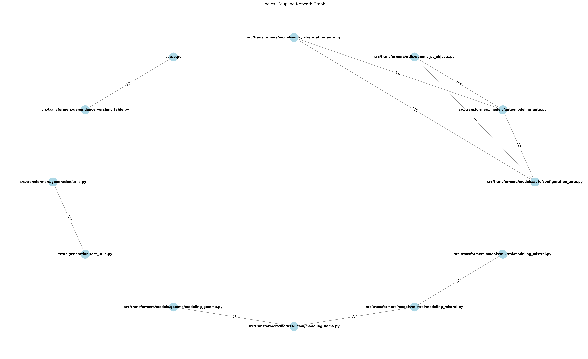
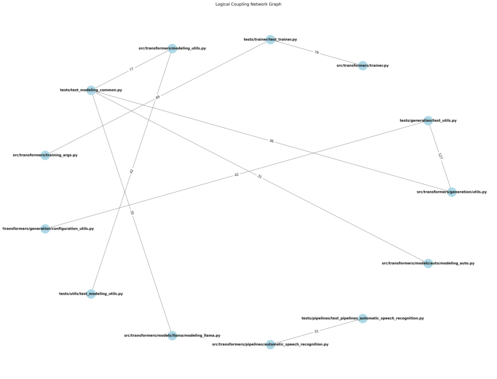

# Fundamentals of Software Systems (FSS)
## Software Evolution - Part I Assignment
**Group g16**

---

## Prerequisites

- **Python Version**: 3.12
- **Installation**:
  ```bash
  python -m venv .venv
  .venv\Scripts\activate  # Windows
  # source .venv/bin/activate  # macOS/Linux
  pip install -r requirements.txt
  ```
- **Runing:**
  ```bash
  source setup.sh  # macOS/Linux
  # source setup.sh # WSL
  jupyter notebook 
  ```

---

## Task 1: Defect Analysis

### Approach & Design Decisions
- I decided to use Pydriller to analyse the commits of the repository. 
- I cloned the repo locally and then did git checkout v4.57.0 to have the correct version.
  - I then put that local path in my pydriller script.
- Due to the script taking a long time to run I added a progress tracker
- I decided to use "commit.committer_date" although one coul also have used "commit.author_date"
  - I did this because this more accuratley represents when the fix has actually bin fixed and merged.  

### Calculate and plot the total number of defects per month. Why do you think the number of defects dropped sharply in October 2025?
See plot under 


**Why do you think the number of defects dropped sharply in October 2025?**
- It seems that the release tag v4.57.0 has no more commits after October 3rd:
- Using git log: git log --since="2025-10-01" --oneline
  - 8ac2b916b0 (HEAD, tag: v4.57.0) Release: v4.57.0
  - 2ccc6cae21 v4.57.0 Branch (#41310)"
- Why is that? We can see that one Commit is "Release: v4.57.0" meaning this release has been finished. The rest of Octobers commits which are AFTER this release are not part of our analysis since we specifically checked out this tag.
- Thats why we do not find such little defects in that month.

### Calculate and plot the number of defects per month for the two files with the highest number of defects.

See plot under 

### In which month were the most defects introduced? How would you explain it? Manually examine the repository for that month (e.g., change logs, releases, commit messages) and come up with a hypothesis.

Looking at the graph we can see that for BOTH files March 2025 has the MOST defects in commit messages mentioned. 
Now this Repository is very active and there are a lot of defects in most of the months mentioned in commit messages. So it is **not really unusually high**.
When we look at the Repository for that month we can see that:

**For modeling_utils.py**:
- Refactor: There happened a MAJOR refactor *071a161d3e [core] Large/full refactor of `from_pretrained` (#36033)*  and also some other commits mentiond refactoing: *1c4b62b219 Refactor some core stuff (#36539)*, *66291778dd Refactor Attention implementation for ViT-based models (#36545)*
  - refactoring can also introduce bugs which then have to be fixed
- New features added: Deepseek: *(eca74d1367 [WIP] add deepseek-v3 (#35926))* also "Gemma 3" is mentioned
- A lot of other fixes: regarding dtype and also some memory management

**For init.py**:
- New features added: 
  - Deepseek: (eca74d1367 [WIP] add deepseek-v3 (#35926))
  - 6acd5aecb3 Adding Qwen3 and Qwen3MoE (#36878)
  - 4303d88c09 Add Phi4 multimodal (#36939)
  - 1d3f35f30a Add model visual debugger (#36798)
  - 6515c25953 Add Prompt Depth Anything Model (#35401)

**Releases**:
 - There have been multiple releases: v4.49.0 up until "v4.50.3-DeepSeek-3, origin/v4.50.3-DeepSeek-3-release" --> There were total of 9 releases!


**Conclusion**: 
- We can see that in both files there was a lot of activity regarding adding new stuff. --> Introduces bugs and also bugfixes.
- In modeling_utils.py there were some refactorings which can also possible lead to the introduction of bugs and the fixing of them. Especially the "[core] Large/full refactor of `from_pretrained`".
  - We can also see that this file has MORE defects in commit messages mentioned than init.py --> This suits our analysis of modeling_utils.py having refactors. 
- There were a lot of releases in that month so a lot of general activity.
- These factors lead to a high possibility of bugs being introduced. Which in turn obviously influences how many bugs have been FIXED also (what we are looking for)

### What are the limitations of this method for finding defective hotspots?
Since we are just analysing commit messages, there are several drawbacks:

- Regarding Commit message quality:
  - Not all commit messages might have an appropriate message
    - eg there is a bugfix but there might not be a keyword contained.
  - We must decide what keywords to filter: 
    - there are many ways to describe if there was a bug fixed. (Different developers use different keywords, different languages etc)

- Regarding no context information :
  - We cannot conclude from the commit message, in which file the bug was fixed, if there were more than 1 file changed in that commit (eg fixes bug in file 1, edits unrelated file 2)
  - We are just analysing when a bug (supposedly) gets *fixed* not when it gets *introduced*. Noone writes: bug introduced, since obviously introducing a bug is done unintentionally. (At least not easily, we can find it out if we do further research using some issue system) --> 
    - The point above makes it hard to identify which code changes introduced the bug, which is crucial for hotspot analysis
  - We dont know how large the bug is, or if its just a typo fix for example.

- Regarding overall hotspot identification limitations:
  - We only capture fixed bugs, not existing one. We gain no information about how the current state of the repo is/ where there are hotspots. 
  - We cannot accurately identify emerging hotspots using this technique alone (eg a utility file that gets changed alot will have a lot of changes in this analysis but is not really a hotspot).
  - We have no other metrics available like size, complexity, coupling cohesion --> We need to use these other metrics in combination with this one for it to be useful!


---

## Task 2: Complexity Analysis

### Selected Complexity Metrics
1. **[Metric 1 ]**: 
2. **[Metric 2 ]**: 

### Approach & Design Decisions

### Calculate the complexity of all .py files in the repository using the selected metrics.

### Visualize the complexity hotspots. The visualization should effectively convey which parts of the code are more complex or change more frequently. Feel free to use any visualization of your choice and explain the rationale behind your decision.


### What can you say about the correlation between the two complexity measures in this repository? For example, if you selected CC and LoC, what can you say for the statement “Files with more lines of code tend to have higher cyclomatic complexity”?


---

## Task 3: Coupling Analysis

### Approach & Design Decisions
- I decided to use Pydriller to analyse the commits of the repository.
- I cloned the repo locally and then did git checkout v4.57.0 to have the correct version.
  - I then wrote a setup.sh script put the path into the environment and source the venv.
- I removed non-python files and `__init__.py` files from the analysis since they do not contribute to logical coupling in a meaningful way for this task.


### Calculate the logical coupling for each file pair in the repository and visualize the top 10 most strongly coupled file pairs.

**Visualization of top 10 coupled pairs:**



### Select a pair of the top 10 most strongly coupled file pairs and analyze why they are coupled.

**Analysis of clustered files:**
- *src/transformers/models/auto/tokenization_auto.py*
- *src/transformers/utils/dummy_pt_objects.py*
- *src/transformers/models/auto/modeling_auto.py*
- *src/transformers/models/auto/configuration_auto.py*

All files except for the *dummy_pt_objects.py* seem to be part of a larger `auto` module 
that handles automatic configurations, tokenizations, and modeling within the Transformers library. 
For this reason, when changes are made to one of these files, it is likely that corresponding changes need to be made in the others
to ensure compatibility and proper functionality across the module.

The *dummy_pt_objects.py* file likely contains placeholder or mock objects used for testing or development purposes within the same context.
So when the auto module files are modified, the dummy objects must also be update to ensure they remain compatible with the latest changes.

Overall, the coupling observed here is expected among the different auto components,
since changes in the automatic model-loading pipeline naturally affect the stages before and after it.
The coupling with dummy_pt_objects.py suggests that updates to the auto module often require adjustments in parts that rely on its interfaces.
This may indicate that the interface for the auto module is not fully consistent, 
a more stable and clearly defined interface could reduce the need to update dummy objects whenever internal changes occur.

### Calculate the logical coupling for file pairs including a source file and a test file in the repository and visualize the top 10 most strongly coupled file pairs.

**Visualization of top 10 coupled pairs:**



### Select a pair of the top 10 most strongly coupled file pairs and analyze why they are coupled.

**Selected Pair Analysis**: 
- *tests/test_modeling_common.py*
- *src/transformers/generation/utils.py*

The file *test_modeling_common.py* is likely a shared testing module used across multiple model implementations.
Because it contains common test logic for validating model behavior, it is unsurprising that it frequently changes together with files such as *modeling_utils.py*, *modeling_llama.py* and *modeling_auto.py*.
All of these liekly belong to the modeling subsystem, so shared tests naturally evolve alongside the underlying model classes they verify.

What stands out, however, is the relatively strong coupling between *test_modeling_common.py* and *utils.py*.
The *utils.py* file appears to serve as a general-purpose helper module for generation purposes.
Since a dedicated test file (*test_utils.py*) already exists, strong coupling between modeling tests and general utilities is unexpected.

This correlation may indicate that *utils.py* contains functionality that goes beyond what should belong in a generic utility file.
Some of its logic might be more appropriately placed in *modeling_utils.py* or another modeling-specific module.
Alternatively, it may be that *test_modeling_common.py* is testing behavior that reaches into non-modeling code, potentially signaling that the test suite is too broad in scope.

### Propose three different strategies for selecting the most “related” test file for a given source file in the Transformers repository.

#### Strategy 1: Matching based on project structure:

This strategy relies on the assumption that the project is organized in the conventional manner.
Meaning that the actual programm code is in a `src/transformers/` directory and the tests are in a parallel `tests` directory.
The structure within in these directories should mirror each other.

When this assumption holds, retrieving the test file of a given source file becomes straightforward. 
By simply replacing the `src/transformers/` prefix with `tests/` and prepending `test_` to the filename, the corresponding test file can be found.

**Pros:**
- Simple implementation
- Efficient retrieval of test files

**Cons:**
- Relies on strict adherence to project structure conventions

#### Strategy 2: Matching based on logical coupling:

This strategy relies on logical coupling between the source file and test files.
Meaning that a source file and the corresponding test file are likely to have a high degree of logical coupling.
As such, the test file with the highest logical coupling to the given source file is likely to be the most related test file.

To identify the test file with the highest logical coupling, one can analyze the commit history of the repository.
Files often changed together in the same commits are likely to be logically coupled.
So computing the test file that was commited most frequently together with the given source file the correstponding test file can be identified.

**Pros:**
- Does not rely on project structure conventions
- Relies on historical data to identify relationships

**Cons:**
- Computationally intensive
- Relies on clean commit history
- May not work for young or less active repositories without sufficient commit data

#### Strategy 3: Dependency based matching:
This strategy analyzes the dependencies found within the test files.
It relies on the assumption that test files that import functionality from a given source file are likely to be testing that functionality.

So by analyzing the import statements in the test files, one can identify which test files depend on the given source file.
As such, the test file that imports that imports and makes use of various functionalities from the source file is likely the file responsible for testing it.

**Pros:**
- Directly analyzes dependencies
- Does not rely on project structure conventions or commit history

**Cons:**
- Complex implementation
- Test might have dependencies that aren't being tested


### Select two of the three test placement implementations you proposed above. Where would they place automatically-generated tests for the src/transformers/generation/utils.py file?

**Using Strategy 1: Matching based on project structure:**

The test file that was found to be corresponding to *src/transformers/generation/utils.py* was *tests/generation/test_utils.py*.
As such, this strategy would append the newly generated tests to this file.

**Using Strategy 2: Matching based on logical coupling:**

The test file that was found to be corresponding to *src/transformers/generation/utils.py* was *tests/generation/test_utils.py*.
As such, this strategy would append the newly generated tests to this file.
This matches the result from Strategy 1. 

---
## Team Members
- Noah Ziegler
- Colin Bächtold
- Piotrmaciej Wojtaszewski