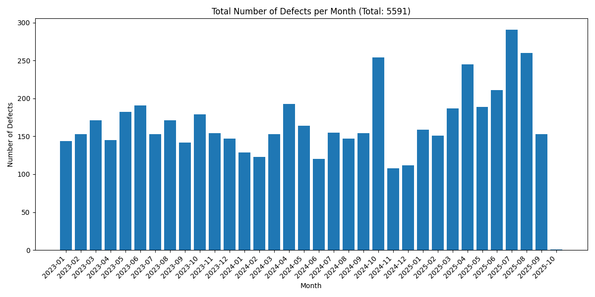
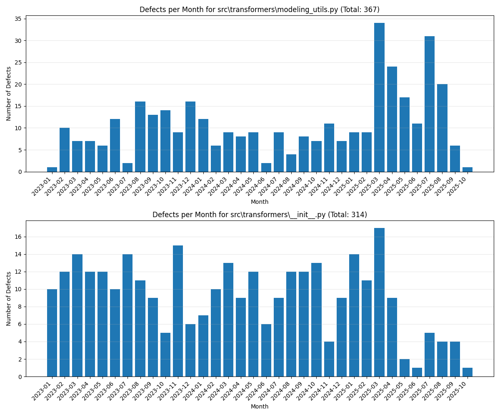
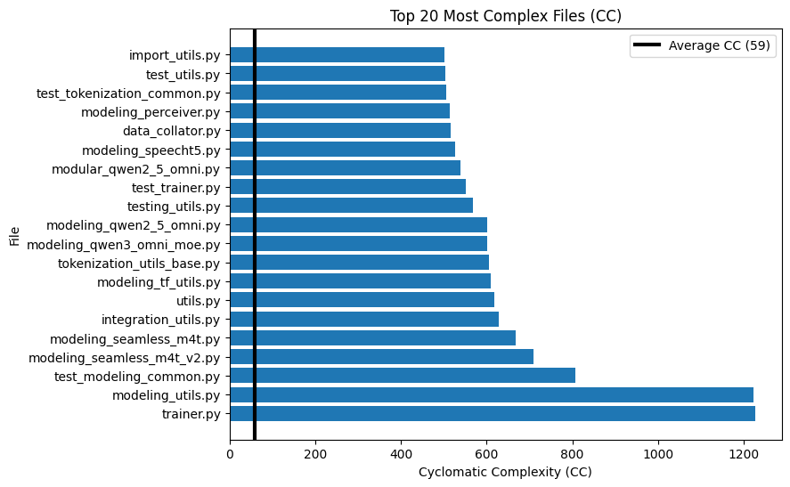
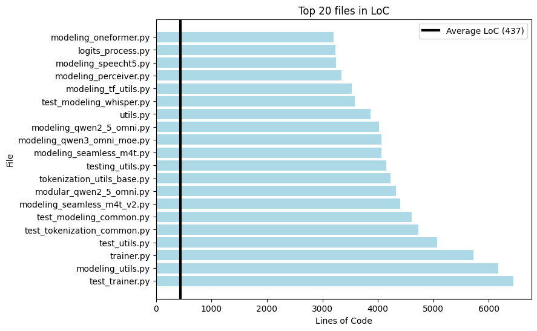
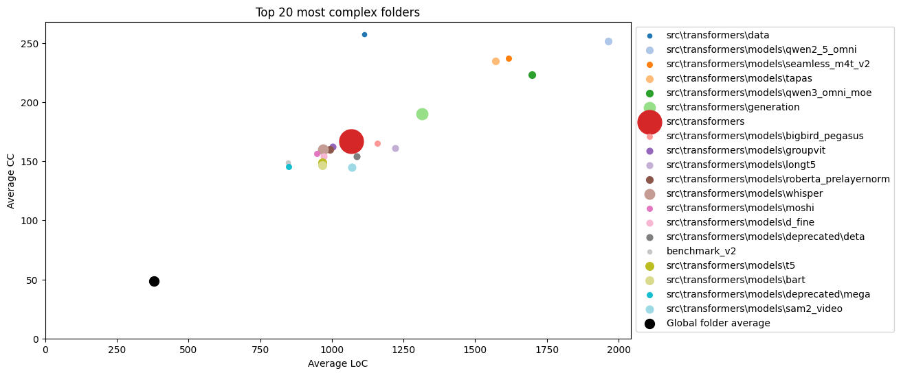

# Fundamentals of Software Systems (FSS)
## Software Evolution - Part I Assignment
**Group g16**

---

## Prerequisites

- **Python Version**: 3.12
- **Installation**:
  ```bash
  python -m venv .venv
  .venv\Scripts\activate  # Windows
  # source .venv/bin/activate  # macOS/Linux
  pip install -r requirements.txt
  ```

---

## Task 1: Defect Analysis

### Approach & Design Decisions
- I decided to use Pydriller to analyse the commits of the repository. 
- I cloned the repo locally and then did git checkout v4.57.0 to have the correct version.
  - I then put that local path in my pydriller script.
- Due to the script taking a long time to run I added a progress tracker
- I decided to use "commit.committer_date" although one coul also have used "commit.author_date"
  - I did this because this more accuratley represents when the fix has actually bin fixed and merged.  

### Calculate and plot the total number of defects per month. Why do you think the number of defects dropped sharply in October 2025?
See plot under 


**Why do you think the number of defects dropped sharply in October 2025?**
- It seems that the release tag v4.57.0 has no more commits after October 3rd:
- Using git log: git log --since="2025-10-01" --oneline
  - 8ac2b916b0 (HEAD, tag: v4.57.0) Release: v4.57.0
  - 2ccc6cae21 v4.57.0 Branch (#41310)"
- Why is that? We can see that one Commit is "Release: v4.57.0" meaning this release has been finished. The rest of Octobers commits which are AFTER this release are not part of our analysis since we specifically checked out this tag.
- Thats why we do not find such little defects in that month.

### Calculate and plot the number of defects per month for the two files with the highest number of defects.

See plot under 

### In which month were the most defects introduced? How would you explain it? Manually examine the repository for that month (e.g., change logs, releases, commit messages) and come up with a hypothesis.

Looking at the graph we can see that for BOTH files March 2025 has the MOST defects in commit messages mentioned. 
Now this Repository is very active and there are a lot of defects in most of the months mentioned in commit messages. So it is **not really unusually high**.
When we look at the Repository for that month we can see that:

**For modeling_utils.py**:
- Refactor: There happened a MAJOR refactor *071a161d3e [core] Large/full refactor of `from_pretrained` (#36033)*  and also some other commits mentiond refactoing: *1c4b62b219 Refactor some core stuff (#36539)*, *66291778dd Refactor Attention implementation for ViT-based models (#36545)*
  - refactoring can also introduce bugs which then have to be fixed
- New features added: Deepseek: *(eca74d1367 [WIP] add deepseek-v3 (#35926))* also "Gemma 3" is mentioned
- A lot of other fixes: regarding dtype and also some memory management

**For init.py**:
- New features added: 
  - Deepseek: (eca74d1367 [WIP] add deepseek-v3 (#35926))
  - 6acd5aecb3 Adding Qwen3 and Qwen3MoE (#36878)
  - 4303d88c09 Add Phi4 multimodal (#36939)
  - 1d3f35f30a Add model visual debugger (#36798)
  - 6515c25953 Add Prompt Depth Anything Model (#35401)

**Releases**:
 - There have been multiple releases: v4.49.0 up until "v4.50.3-DeepSeek-3, origin/v4.50.3-DeepSeek-3-release" --> There were total of 9 releases!


**Conclusion**: 
- We can see that in both files there was a lot of activity regarding adding new stuff. --> Introduces bugs and also bugfixes.
- In modeling_utils.py there were some refactorings which can also possible lead to the introduction of bugs and the fixing of them. Especially the "[core] Large/full refactor of `from_pretrained`".
  - We can also see that this file has MORE defects in commit messages mentioned than init.py --> This suits our analysis of modeling_utils.py having refactors. 
- There were a lot of releases in that month so a lot of general activity.
- These factors lead to a high possibility of bugs being introduced. Which in turn obviously influences how many bugs have been FIXED also (what we are looking for)

### What are the limitations of this method for finding defective hotspots?
Since we are just analysing commit messages, there are several drawbacks:

- Regarding Commit message quality:
  - Not all commit messages might have an appropriate message
    - eg there is a bugfix but there might not be a keyword contained.
  - We must decide what keywords to filter: 
    - there are many ways to describe if there was a bug fixed. (Different developers use different keywords, different languages etc)

- Regarding no context information :
  - We cannot conclude from the commit message, in which file the bug was fixed, if there were more than 1 file changed in that commit (eg fixes bug in file 1, edits unrelated file 2)
  - We are just analysing when a bug (supposedly) gets *fixed* not when it gets *introduced*. Noone writes: bug introduced, since obviously introducing a bug is done unintentionally. (At least not easily, we can find it out if we do further research using some issue system) --> 
    - The point above makes it hard to identify which code changes introduced the bug, which is crucial for hotspot analysis
  - We dont know how large the bug is, or if its just a typo fix for example.

- Regarding overall hotspot identification limitations:
  - We only capture fixed bugs, not existing one. We gain no information about how the current state of the repo is/ where there are hotspots. 
  - We cannot accurately identify emerging hotspots using this technique alone (eg a utility file that gets changed alot will have a lot of changes in this analysis but is not really a hotspot).
  - We have no other metrics available like size, complexity, coupling cohesion --> We need to use these other metrics in combination with this one for it to be useful!


---

## Task 2: Complexity Analysis

### Selected Complexity Metrics
1. **[Metric 1 ]**: Cyclomatic Complexity (CC)
2. **[Metric 2 ]**: Lines of Code (LoC)

### Approach & Design Decisions

### Calculate the complexity of all .py files in the repository using the selected metrics.

### Visualize the complexity hotspots. The visualization should effectively convey which parts of the code are more complex or change more frequently. Feel free to use any visualization of your choice and explain the rationale behind your decision.

I started by making two basic bar charts of the most complex files, one for each complexity metric. This shows how much more complex the top files are from the average file and thus more likely to cause issues. The black line shows the complexity of the average file and we see that the top files are orders of magnitude more complex than that. However, using the file names doesn't give a good snapshot of the whole picture as a visualization should. This kind of graph might as well be a list. For this reason I decided to experiment with grouping the files in certain ways to get a more intuitive and accurate snapshot of where the complexity lies when looking at the repository as a whole. In my opinion grouping the files correctly would lead to the most effective visualization of where the files in the repository are the most complex.

CC 
LoC 

Final Visualztion:
As such I experimented with a couple of different groupings. Ideally a repo owner of somebody with knowledge about how to categorize each part of the repo would come in and label each part as its own little universe. I had to approach this from a more programatic perspective and experiemented with visualizing the individual file outliers on a scatter which contained too much information and not enough holistic information. For this reason I decided to try to group the files as best as I could and importantly analyze averages, in order to not skew the results to bigger / mroe varied folders. I grouped the files by parent folder name, parent folder path, parent of parent folder path and parent of parent folder name string matching. The parent folder path gave the best mix of general information which is able to the most insight into the question which part of the code is most complex. Furthermore, I made the dots of the folders with more files larger giving the viewer an indea of the scale of the problem. In this way the viewer can look at the outliers such as the qwen2_5_omni folder and see that its the most complex, however its unlikely to give the developers the biggest headace as its only got a couple of files. Meanwhile the src/transformers fodler is very complex but also contains a lot of files meaning that it can be seen as the one liekely to cause problems in the future. As such I think the combination of the two axis and the size dimension gives the viewer the most information to interpret.

Scatter Plot 


### What can you say about the correlation between the two complexity measures in this repository? For example, if you selected CC and LoC, what can you say for the statement “Files with more lines of code tend to have higher cyclomatic complexity”?

From this scatter plot but also other plots that i did as part of the exploration it is obvious that the files that have more lines of code have higher cyclomatic complexity. There is a strong positive correliation between CC and LoC.

###  A colleague of yours claims that “Files with higher complexity tend to be more defective”. What evidence can you present to support or reject this claim for the selected complexity measures in this repository?

By comparing the the Top 20 most defect files from Task 1: 
 [('src\\transformers\\modeling_utils.py', 367), ('src\\transformers\\__init__.py', 314), ('src\\transformers\\trainer.py', 302), ('docs\\source\\en\\_toctree.yml', 284), ('src\\transformers\\models\\auto\\modeling_auto.py', 260), ('tests\\test_modeling_common.py', 255), ('src\\transformers\\models\\auto\\configuration_auto.py', 246), ('src\\transformers\\generation\\utils.py', 217), ('src\\transformers\\utils\\dummy_pt_objects.py', 209), ('src\\transformers\\models\\__init__.py', 205), ('src\\transformers\\utils\\import_utils.py', 166), ('docs\\source\\ko\\_toctree.yml', 166), ('tests\\generation\\test_utils.py', 157), ('src\\transformers\\models\\llama\\modeling_llama.py', 150), ('src\\transformers\\training_args.py', 149), ('src\\transformers\\models\\auto\\tokenization_auto.py', 146), ('src\\transformers\\testing_utils.py', 146), (None, 142), ('src\\transformers\\models\\auto\\image_processing_auto.py', 138), ('docs\\source\\en\\index.md', 132)]

 To the top 20 files with most CC and most LOC (see above) we can see that there is a clear overlap: 
 Top 20 CC (Cyclomatic Complexity) compared with Top 20 Defects
- modeling_utils.py (CC rank #2, Defects rank #1 with 367 defects)
- trainer.py (CC rank #1, Defects rank #3 with 302 defects)
- test_modeling_common.py (CC rank #3, Defects rank #6 with 255 defects)
- utils.py (CC rank #7, Defects rank #8 with 217 defects)
- testing_utils.py (CC rank #12, Defects rank #17 with 146 defects)
- test_utils.py (CC rank #19, Defects rank #13 with 157 defects)
- import_utils.py (CC rank #20, Defects rank #11 with 166 defects)

Top 20 LoC (Lines of Code) compared with Top 20 Defects
- modeling_utils.py (LoC rank #2, Defects rank #1 with 367 defects)
- trainer.py (LoC rank #3, Defects rank #3 with 302 defects)
- test_modeling_common.py (LoC rank #6, Defects rank #6 with 255 defects)
- testing_utils.py (LoC rank #10, Defects rank #17 with 146 defects)
- utils.py (LoC rank #14, Defects rank #8 with 217 defects)
- test_utils.py (LoC rank #4, Defects rank #13 with 157 defects)

There is a 7 out of 20 files (35%) overlap between top 20 defect files and top 20 most CC files and a  6 out of 20 files (30%) overlap between top 20 defect files and top 20 most LOC files. 
We can see that there is a clear correlation between files having a high CC/ LOC and also having a lot of defects. So the colleagues claim is correct and the evidence above supports this. 


## Task 3: Coupling Analysis

### Approach & Design Decisions


### Calculate the logical coupling for each file pair in the repository. Visualize the 10 most coupled file pairs using a visualization of your choice that effectively conveys the coupling relationships. Select one of these 10 most coupled file pairs and comment on their relationship.

**Top coupled pairs:**
[]

**Selected Pair Analysis**: 
- **File 1**: 
- **File 2**:

**Comment on their relationship**:


### Repeat the steps of the bullet point above, but consider only file pairs where the one file is a Python test file, i.e., starts with “test ”, and the other is a Python non-test file. How would you explain this type of coupling? Is it a code smell that requires attention and signals potential refactoring opportunities or is it something different?


**Top coupled pairs:**
[]

**Selected Pair Analysis**: 
- **File 1**:
- **File 2**:


**Explanation of this Coupling**: 


### Writing tests is a time-consuming task and developers often omit it, thus, automated test generation tools have been implemented and are widely used. One of the most popular test generation tools for Python is Pynguin, that takes as input a .py file and generates passing tests for that file. Pynguin writes the generated tests to a new file in a separate folder, isolated from the project’s test suite. Suppose that you are tasked with implementing an option for Pynguin to place the tests directly in the project’s test suite, specifically in the test file that is most closely “related” with the input .py file. Discuss at least three (3) implementations for selecting the most “related” test file given a (non-test) .py file. You do not have to implement these options at this stage.

#### Strategy 1:


#### Strategy 2:


#### Strategy 3:


### Select two of the three test placement implementations you proposed above. Where would they place automatically-generated tests for the src/transformers/generation/utils.py file?

**Using Strategy 1**: 

**Using Strategy 2**:


---
## Team Members
- Noah Ziegler
- Colin Bächtold
- Piotr Maciej Wojtaszewski


# Comments on the use of Generative AI
## Piotr 
I try to use GenAI (ChatGPT 5.1) as a tutor and a help with documentation as described in the assignment pdf. The ideas of what to make, and how to change it are entirely my own. I use GenAI to for instance give me an example scatter plot so that I know what general commands are used to make one in matplotlib. I find using this tool is much quicker than having to sort though many pages of library docs (which in my opinion are now only relevant for very specific issues). In general I try to adapt very general examples into specific code that is my implementation. In terms of thinking and strategic decision making of for instance how to group files or what plots to use that is entirely my own. In terms of troubleshooting in general I find GenAI to be extremely useful for that but in this assignment I had very little bugs due to just working with a basic df and basic graphs so i didn't do much error analysis with GenAI.

**Prompts used**:
give me a quick crash course on how to use cc_visit on a repo
show me how to use radon to calculate code complexities
how to append new row to pandas df
how to get filename using path
how to make horizontal bar chart in plt
how to group data from dataframe by column
when doing group data from dataframe by column how to make a new column that shows how many rows went into the gorup
create cheat sheet for making scatter plots in plt
how to make legend appear outside of plt graph

## Noah
I used AI to help me better understand the tools I am using.

**Prompts used**:
- Help me understand the pydriller python library. Explain what it does. Explain its most used functionality. Explain how to use it. Give a comprehensive example with the most used functionalities of that library.
- Explain how do use git to mine commit messages. Explain how to use git to count commit messages. Explain how to look for specific keywords. 
- Help me understand matplotlib. Explain the most common used functionality. Explain how to create a basic chart. Give a comprehensive example with the most used functionalities of that library.
